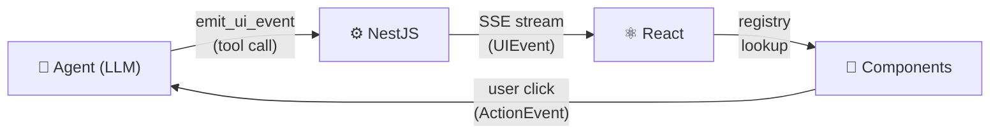
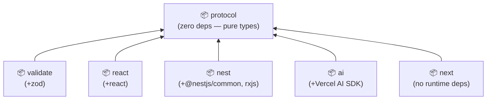

# AgentUI

[](https://www.typescriptlang.org/)
[](./LICENSE)
[](https://pnpm.io/)
[](#packages)

**An AI-native component system for agent-driven UIs.**

Instead of letting a model generate raw HTML or JSX (unsafe, unpredictable, impossible to style consistently), AgentUI gives LLM agents a typed event protocol to **compose, update, and remove UI components** — all validated against a schema and rendered through a developer-controlled registry.

<p align="center">
  
</p>

---

## The Problem

Most AI chat interfaces look the same: a text bubble stream. But real agentic apps need richer output — tables, cards, task boards, status dashboards — rendered safely and consistently.

The naive approach is to have the LLM write JSX or HTML directly. This breaks in practice:

- Output is inconsistent and hard to style
- No validation — the model can emit anything
- No interactivity feedback loop back to the agent
- Impossible to maintain design system coherence

---

## The Solution

AgentUI introduces a **UI event protocol** between your agent and your frontend:



The agent never touches your DOM. It emits **structured events**. Your frontend renders them through a **whitelisted component registry** you control.

---

## How It Works

### 1. The agent emits a typed UI event

Instead of writing `<table>...</table>`, the agent calls a tool:

```json
{
  "op": "append",
  "id": "sales-table",
  "component": "data-table",
  "props": {
    "columns": ["Product", "Revenue", "Growth"],
    "rows": [
      ["Pro Plan", "$48,200", "+12%"],
      ["Starter", "$18,700", "+4%"]
    ]
  }
}
```

### 2. AgentUI validates and streams it

The backend validates the event with Zod, then streams it to the client over SSE.

```typescript
// NestJS controller — one line of setup
const controller = createAgentController({ agent, tools });
```

### 3. React renders it through your registry

```typescript
import { createRegistry, AgentUIProvider, AgentRenderer } from '@kibadist/agentui-react';

const registry = createRegistry({
  'data-table': DataTable,
  'info-card':  InfoCard,
  'text-block': TextBlock,
  'task-board': TaskBoard,
  'stat-card':  StatCard,
});

export function App() {
  return (
    <AgentUIProvider registry={registry} sessionId="demo">
      <Chat />
      <AgentRenderer />
    </AgentUIProvider>
  );
}
```

Only components in your registry can be rendered. The model cannot escape the sandbox.

### 4. User actions route back to the agent

```typescript
import { useAgentAction } from '@kibadist/agentui-react';

function TaskCard({ id, title, status }) {
  const dispatch = useAgentAction();

  return (
    <button onClick={() => dispatch({ type: 'task.complete', payload: { id } })}>
      Complete
    </button>
  );
}
```

User interactions are sent back as `ActionEvent`s — the agent can react to them and emit new UI events in response.

---

## Supported UI Operations

| Operation | Description |
|-----------|-------------|
| `append` | Add a new component to the canvas |
| `replace` | Swap props on an existing component |
| `remove` | Delete a component by ID |
| `toast` | Show a transient notification |

---

## Example Prompts

Try these once you have the dev server running:

```
Show me a summary of recent sales
```
→ Renders a `stat-card` grid + `data-table`

```
Compare pricing plans for a SaaS product
```
→ Renders a structured comparison `data-table`

```
Create a project task board with backlog, in progress, and done columns
```
→ Renders a `task-board` with draggable cards

```
Show system health status for production servers
```
→ Renders `stat-card` components with live-style indicators

---

## Quick Start

### Prerequisites

- **Node.js** >= 18
- **pnpm** >= 9 (`corepack enable` to auto-install)

### Install & Run

```bash
# Clone and install
git clone https://github.com/kibadist/agentui
cd agentui
pnpm install

# Build all packages
pnpm build

# Add your API key (Anthropic, OpenAI, DeepSeek, or Google — all supported)
echo "ANTHROPIC_API_KEY=sk-ant-your-key-here" > examples/nest-api/.env
echo "PORT=3001" >> examples/nest-api/.env

# Run backend (:3001) + frontend (:3000) together
pnpm dev
```

Open [http://localhost:3000](http://localhost:3000).

```bash
# Or run individually
pnpm dev:api   # NestJS backend on :3001
pnpm dev:app   # Next.js frontend on :3000
```

---

## Packages

| Package | npm | Purpose |
|---------|-----|---------|
| [`@kibadist/agentui-protocol`](https://www.npmjs.com/package/@kibadist/agentui-protocol) | [](https://www.npmjs.com/package/@kibadist/agentui-protocol) | TypeScript types for the wire protocol (`UIEvent`, `ActionEvent`, `UINode`) |
| [`@kibadist/agentui-validate`](https://www.npmjs.com/package/@kibadist/agentui-validate) | [](https://www.npmjs.com/package/@kibadist/agentui-validate) | Zod schemas + parsers (`parseUIEvent`, `safeParseUIEvent`) |
| [`@kibadist/agentui-react`](https://www.npmjs.com/package/@kibadist/agentui-react) | [](https://www.npmjs.com/package/@kibadist/agentui-react) | Registry, renderer, SSE hook, action context |
| [`@kibadist/agentui-nest`](https://www.npmjs.com/package/@kibadist/agentui-nest) | [](https://www.npmjs.com/package/@kibadist/agentui-nest) | Session event bus + controller factory for NestJS |
| [`@kibadist/agentui-ai`](https://www.npmjs.com/package/@kibadist/agentui-ai) | [](https://www.npmjs.com/package/@kibadist/agentui-ai) | Provider-agnostic adapter via Vercel AI SDK (OpenAI, Anthropic, Google, DeepSeek) |
| [`@kibadist/agentui-next`](https://www.npmjs.com/package/@kibadist/agentui-next) | [](https://www.npmjs.com/package/@kibadist/agentui-next) | SSE proxy + action proxy helpers for Next.js App Router |

---



---

## Use Cases

AgentUI is a good fit when you need an LLM to **compose structured UI** rather than just stream text:

- **Internal dashboards** — agent queries your DB and renders tables, charts, stat cards
- **AI copilots** — agent renders contextual UI panels alongside a chat interface
- **Agentic workflows** — agent builds task boards, checklists, or forms that users interact with
- **CRM / ops tools** — agent surfaces customer data or job status as rich UI components
- **Dev tools** — agent renders structured output (test results, diffs, API responses) in a readable format

---

## Roadmap

- [ ] Streaming partial renders (render component as props stream in)
- [ ] Built-in component library (zero-config starter components)
- [ ] Vue adapter (`@kibadist/agentui-vue`)
- [ ] `ui.update` patch operation (partial prop update without full replace)
- [ ] Persistence layer (replay UI state across sessions)

---

## Contributing

Issues and PRs welcome. The repo is a pnpm monorepo — see each package's `README` for package-specific docs.

```bash
pnpm build        # build all packages
pnpm test         # run tests across workspace
pnpm lint         # lint all packages
```

---

## License

MIT © [Maksym Ivashchenko](https://github.com/kibadist)
