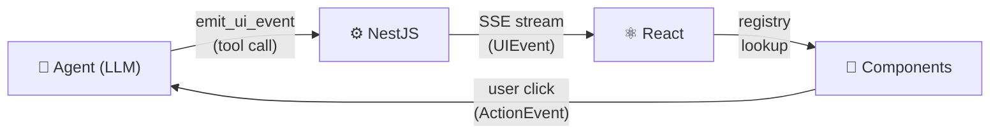

# AgentUI

[](https://kibadist.github.io/agentui/)
[](https://www.typescriptlang.org/)
[](./LICENSE)
[](https://pnpm.io/)
[](https://kibadist.github.io/agentui/packages/)

**An AI-native component system for agent-driven UIs.**

> 📖 **Full documentation:** [kibadist.github.io/agentui](https://kibadist.github.io/agentui/)

Instead of letting a model generate raw HTML or JSX (unsafe, unpredictable, impossible to style consistently), AgentUI gives LLM agents a typed event protocol to **compose, update, and remove UI components** — all validated against a schema and rendered through a developer-controlled registry.

<p align="center">
  
</p>

---

## How it works

The agent emits structured **UI events**. Your frontend renders them through a **whitelisted component registry** you control. User interactions return as **action events** on the same SSE-backed session.



```tsx
import { createRegistry, AgentRoot, AgentRenderer } from '@kibadist/agentui-react';

const registry = createRegistry({
  'data-table': DataTable,
  'info-card':  InfoCard,
});

export function App() {
  return (
    <AgentRoot endpoint="/api/agent">
      <AgentRenderer registry={registry} />
    </AgentRoot>
  );
}
```

For the full walkthrough see [Concepts](https://kibadist.github.io/agentui/concepts/) and [Getting Started](https://kibadist.github.io/agentui/getting-started/).

---

## Documentation

All long-form documentation lives at **[kibadist.github.io/agentui](https://kibadist.github.io/agentui/)**.

### Start here

- [Getting Started](https://kibadist.github.io/agentui/getting-started/) — prereqs, install, dev server, example prompts
- [Concepts](https://kibadist.github.io/agentui/concepts/) — the problem, the typed-event approach, the flow
- [Wire Protocol](https://kibadist.github.io/agentui/wire-protocol/) — every operation, with payload examples

### Guides — Client (`@kibadist/agentui-react`)

- [`<AgentRoot>`](https://kibadist.github.io/agentui/guides/agent-root/)
- [Renderer](https://kibadist.github.io/agentui/guides/renderer/)
- [State selectors](https://kibadist.github.io/agentui/guides/state-selectors/)
- [Custom wire events](https://kibadist.github.io/agentui/guides/custom-wire-events/)
- [Tool calls](https://kibadist.github.io/agentui/guides/tool-calls/)
- [Reasoning](https://kibadist.github.io/agentui/guides/reasoning/)
- [Workflows / steppers](https://kibadist.github.io/agentui/guides/workflows/)
- [Optimistic updates](https://kibadist.github.io/agentui/guides/optimistic/)
- [Schema-first nodes](https://kibadist.github.io/agentui/guides/schema-first-nodes/)
- [Stream resilience](https://kibadist.github.io/agentui/guides/stream-resilience/)
- [Memory caps & metrics](https://kibadist.github.io/agentui/guides/memory-caps/)
- [Testing](https://kibadist.github.io/agentui/guides/testing/)
- [DevTools panel](https://kibadist.github.io/agentui/guides/devtools/)

### Guides — Server

- [Server companion (Node)](https://kibadist.github.io/agentui/guides/server-node/)
- [LLM adapters](https://kibadist.github.io/agentui/guides/llm-adapters/)
- [JSON Schema export](https://kibadist.github.io/agentui/guides/json-schema-export/)

### Guides — Tooling

- [CLI generator](https://kibadist.github.io/agentui/guides/cli-generator/)

### Reference

- [Packages](https://kibadist.github.io/agentui/packages/) — full package matrix + dependency graph
- [Use Cases](https://kibadist.github.io/agentui/use-cases/)
- [Roadmap](https://kibadist.github.io/agentui/roadmap/)
- [Stability](./STABILITY.md) — what's covered by semver
- [Migration: 0.x → 1.0](./MIGRATION-1.0.md)
- [Changelog](./CHANGELOG.md)

---

## Packages

| Package | npm | Purpose |
|---------|-----|---------|
| [`@kibadist/agentui-protocol`](https://www.npmjs.com/package/@kibadist/agentui-protocol) | [](https://www.npmjs.com/package/@kibadist/agentui-protocol) | TypeScript types for the wire protocol |
| [`@kibadist/agentui-validate`](https://www.npmjs.com/package/@kibadist/agentui-validate) | [](https://www.npmjs.com/package/@kibadist/agentui-validate) | Zod schemas + parsers + JSON Schema files |
| [`@kibadist/agentui-react`](https://www.npmjs.com/package/@kibadist/agentui-react) | [](https://www.npmjs.com/package/@kibadist/agentui-react) | Registry, renderer, SSE hook, action context |
| [`@kibadist/agentui-node`](https://www.npmjs.com/package/@kibadist/agentui-node) | [](https://www.npmjs.com/package/@kibadist/agentui-node) | Framework-agnostic Node/Web server primitives |
| [`@kibadist/agentui-nest`](https://www.npmjs.com/package/@kibadist/agentui-nest) | [](https://www.npmjs.com/package/@kibadist/agentui-nest) | Session event bus + controller factory for NestJS |
| [`@kibadist/agentui-ai`](https://www.npmjs.com/package/@kibadist/agentui-ai) | [](https://www.npmjs.com/package/@kibadist/agentui-ai) | Provider-agnostic adapter via Vercel AI SDK |
| [`@kibadist/agentui-llm`](https://www.npmjs.com/package/@kibadist/agentui-llm) | [](https://www.npmjs.com/package/@kibadist/agentui-llm) | Provider-native LLM stream adapters |
| [`@kibadist/agentui-next`](https://www.npmjs.com/package/@kibadist/agentui-next) | [](https://www.npmjs.com/package/@kibadist/agentui-next) | SSE + action proxy for Next.js App Router |

See [Packages](https://kibadist.github.io/agentui/packages/) for the dependency graph.

---

## Starter templates

Three reference projects in `examples/`. Each runs standalone with a mock SSE backend (no separate Nest server needed).

| Example | Port | Demonstrates |
|---|---|---|
| [`chat-starter`](./examples/chat-starter) | 3010 | Minimal Next.js + `<AgentRoot>` + a single-process mock SSE backend |
| [`support-bot`](./examples/support-bot) | 3011 | Multi-turn agent with tool calls, reasoning trace, and file upload stub |
| [`internal-tools`](./examples/internal-tools) | 3012 | Agent embedded as a side panel in a mock CRUD app |

Run any of them:

```bash
pnpm install
pnpm build
pnpm --filter @kibadist/agentui-example-chat-starter dev
```

---

## Contributing

Issues and PRs welcome. See [CONTRIBUTING.md](./CONTRIBUTING.md) for local setup, test bar, and PR conventions. Protocol-level proposals go through [`rfcs/`](./rfcs/).

```bash
pnpm build        # build all packages
pnpm test         # run tests across workspace
pnpm typecheck    # tsc --noEmit
```

---

## License

MIT © [Maksym Ivashchenko](https://github.com/kibadist)
