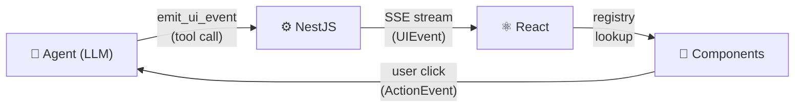

# Docs Restructure Implementation Plan

> **For agentic workers:** REQUIRED SUB-SKILL: Use superpowers:subagent-driven-development (recommended) or superpowers:executing-plans to implement this plan task-by-task. Steps use checkbox (`- [ ]`) syntax for tracking.

**Goal:** Split the current 942-line `README.md` into a ~150-line landing/index page plus 22 topical pages under `docs/`, with content copied verbatim from the README.

**Architecture:** Mechanical content migration in six tasks. Tasks 1–4 add new files under `docs/` (additive, leaves repo working). Task 5 rewrites `README.md`. Task 6 sweeps the few external referrers and validates. Each task ends in one commit.

**Tech Stack:** Plain markdown. No code changes. No new tooling.

---

## Reference: content mapping (sourced from spec)

Every new file lifts its content from a specific range in the current `README.md`. The implementer must read those exact lines and copy verbatim, only adjusting header levels (the section's `###` becomes `#` for the page title; any `####` inside becomes `##`).

| New file | README source lines |
|---|---|
| `docs/getting-started.md` | 790–848 (Quick Start + Example Prompts) |
| `docs/concepts.md` | 17–125 (The Problem, The Solution, How It Works) |
| `docs/wire-protocol.md` | 127–226, 780–787 (Operations, JSON Patch, partial-JSON, Capabilities, Reset, Drop-protocol-dep) |
| `docs/packages.md` | 850–902 (Packages table + dep graph) |
| `docs/use-cases.md` | 906–915 |
| `docs/roadmap.md` | 918–925 |
| `docs/guides/agent-root.md` | 449–504 |
| `docs/guides/renderer.md` | 228–245 |
| `docs/guides/state-selectors.md` | 247–277 |
| `docs/guides/tool-calls.md` | 279–317 |
| `docs/guides/reasoning.md` | 319–351 |
| `docs/guides/workflows.md` | 353–401 |
| `docs/guides/optimistic.md` | 403–447 |
| `docs/guides/schema-first-nodes.md` | 670–698 |
| `docs/guides/stream-resilience.md` | 700–718 |
| `docs/guides/memory-caps.md` | 720–751 |
| `docs/guides/testing.md` | 753–778 |
| `docs/guides/devtools.md` | 611–639 |
| `docs/guides/server-node.md` | 533–599 |
| `docs/guides/llm-adapters.md` | 506–531 |
| `docs/guides/json-schema-export.md` | 600–609 |
| `docs/guides/cli-generator.md` | 641–668 |

## Reference: "Related" footer mapping

Each page ends with a `## Related` section linking to 1–3 adjacent pages. Use the exact slug list below for each file. Use relative links (e.g., from `docs/guides/foo.md`, link to `./bar.md` for a sibling guide and `../wire-protocol.md` for a top-level page).

| Page | Related links |
|---|---|
| `docs/getting-started.md` | `concepts.md`, `guides/agent-root.md` |
| `docs/concepts.md` | `wire-protocol.md`, `getting-started.md` |
| `docs/wire-protocol.md` | `concepts.md`, `guides/json-schema-export.md` |
| `docs/packages.md` | `guides/server-node.md`, `guides/llm-adapters.md` |
| `docs/use-cases.md` | `concepts.md` |
| `docs/roadmap.md` | (omit Related — pure status doc) |
| `docs/guides/agent-root.md` | `state-selectors.md`, `renderer.md`, `server-node.md` |
| `docs/guides/renderer.md` | `agent-root.md`, `state-selectors.md` |
| `docs/guides/state-selectors.md` | `agent-root.md`, `testing.md` |
| `docs/guides/tool-calls.md` | `reasoning.md`, `optimistic.md` |
| `docs/guides/reasoning.md` | `tool-calls.md` |
| `docs/guides/workflows.md` | `tool-calls.md` |
| `docs/guides/optimistic.md` | `tool-calls.md` |
| `docs/guides/schema-first-nodes.md` | `renderer.md`, `../wire-protocol.md` |
| `docs/guides/stream-resilience.md` | `server-node.md`, `agent-root.md` |
| `docs/guides/memory-caps.md` | `devtools.md`, `testing.md` |
| `docs/guides/testing.md` | `state-selectors.md`, `devtools.md` |
| `docs/guides/devtools.md` | `testing.md` |
| `docs/guides/server-node.md` | `llm-adapters.md`, `json-schema-export.md` |
| `docs/guides/llm-adapters.md` | `server-node.md` |
| `docs/guides/json-schema-export.md` | `../wire-protocol.md`, `server-node.md` |
| `docs/guides/cli-generator.md` | `schema-first-nodes.md` |

## Reference: page format

Every new page follows this shape:

```markdown
# <Title>

<one-line tagline — lift the first sentence from the README section, or use the section's heading-prose>

<verbatim content from README, with header levels adjusted as described above>

## Related

- [Adjacent page title](./adjacent.md)
- [Another adjacent page](./another.md)
```

---

## Task 1: Migrate top-level docs pages + docs index

**Files:**
- Create: `docs/README.md` (docs-internal index)
- Create: `docs/getting-started.md`
- Create: `docs/concepts.md`
- Create: `docs/wire-protocol.md`
- Create: `docs/packages.md`
- Create: `docs/use-cases.md`
- Create: `docs/roadmap.md`

This task adds the six top-level doc pages plus a `docs/README.md` index. No edits to root `README.md` yet.

- [ ] **Step 1: Read README source ranges**

Read `README.md` lines 17–225, 780–787, 790–925 to understand each source section's exact content.

```bash
sed -n '17,225p;780,787p;790,925p' README.md
```

- [ ] **Step 2: Create `docs/getting-started.md`**

Source: `README.md` lines 790–848 (the "Quick Start" + "Example Prompts" sections). Quick Start is currently an H2 (`## Quick Start`); Example Prompts is also an H2. Both become H2 inside the page (page title is H1).

File content shape:

```markdown
# Getting Started

Install dependencies, configure an API key, and run the dev server.

## Prerequisites

- **Node.js** >= 18
- **pnpm** >= 9 (`corepack enable` to auto-install)

## Install & Run

<verbatim block from README lines 825–848>

## Example Prompts

<verbatim block from README lines 790–815>

## Related

- [Concepts](./concepts.md)
- [`<AgentRoot>` guide](./guides/agent-root.md)
```

- [ ] **Step 3: Create `docs/concepts.md`**

Source: `README.md` lines 17–125 (The Problem, The Solution, How It Works). Source headers are H2 (`## The Problem` etc.) and H3 (`### 1. The agent emits...`). Promote H2 → H2 (still H2 under the page H1), keep H3 as H3.

File content shape:

```markdown
# Concepts

How an LLM agent composes UI in AgentUI — the problem this solves, the protocol, and the four-step flow.

## The Problem

<verbatim block from README lines 18–28>

## The Solution

<verbatim block from README lines 31–48>

## How It Works

<verbatim block from README lines 52–124, including the four numbered subsections>

## Related

- [Wire Protocol](./wire-protocol.md)
- [Getting Started](./getting-started.md)
```

- [ ] **Step 4: Create `docs/wire-protocol.md`**

Source: `README.md` lines 127–226 (Supported UI Operations, JSON Patch payloads, Streaming partial-JSON, Capabilities handshake, Resetting a conversation) plus 780–787 (Dropping the protocol direct dep). Source `## Supported UI Operations` becomes H2; nested `### JSON Patch payloads` etc. become H2.

File content shape:

```markdown
# Wire Protocol

The complete set of typed events agents emit and clients render. Validated server-side via Zod; rendered through a developer-controlled registry.

## Supported UI Operations

<verbatim block from README lines 129–138 — the table>

## JSON Patch payloads for `ui.replace`

<verbatim block from README lines 140–158>

## Streaming partial-JSON

<verbatim block from README lines 161–175>

## Capabilities handshake

<verbatim block from README lines 178–217>

## Resetting a conversation

<verbatim block from README lines 220–226>

## Dropping the protocol direct dep

<verbatim block from README lines 781–787>

## Related

- [Concepts](./concepts.md)
- [JSON Schema export](./guides/json-schema-export.md)
```

- [ ] **Step 5: Create `docs/packages.md`**

Source: `README.md` lines 850–902 (Packages section, table, and Mermaid dep graph).

File content shape:

```markdown
# Packages

The AgentUI monorepo publishes seven packages under the `@kibadist/agentui-*` scope.

<verbatim package table from README lines 854–862>

## Dependency graph

<verbatim Mermaid block from README lines 888–902>

## Related

- [Server companion guide](./guides/server-node.md)
- [LLM adapters guide](./guides/llm-adapters.md)
```

- [ ] **Step 6: Create `docs/use-cases.md`**

Source: `README.md` lines 906–915.

File content shape:

```markdown
# Use Cases

AgentUI is a good fit when you need an LLM to compose structured UI rather than just stream text.

<verbatim bullet list from README lines 910–914>

## Related

- [Concepts](./concepts.md)
```

- [ ] **Step 7: Create `docs/roadmap.md`**

Source: `README.md` lines 918–925.

File content shape:

```markdown
# Roadmap

Tracked roadmap items for AgentUI. For shipped work, see `CHANGELOG.md`.

<verbatim checkbox list from README lines 920–924>
```

No Related section on this page (per the mapping table).

- [ ] **Step 8: Create `docs/README.md`** (docs-internal index)

```markdown
# AgentUI Documentation

This directory contains the long-form docs for AgentUI. The project [`README.md`](../README.md) mirrors this index for the GitHub landing page.

## Start here

- [Getting Started](./getting-started.md) — prereqs, install, dev server, first prompt
- [Concepts](./concepts.md) — the problem, the typed-event approach, the flow
- [Wire Protocol](./wire-protocol.md) — every operation, with payload examples

## Guides

### Client (`@kibadist/agentui-react`)

- [`<AgentRoot>`](./guides/agent-root.md) — top-level provider, multi-agent namespacing
- [Renderer](./guides/renderer.md) — `<AgentRenderer>` props
- [State selectors](./guides/state-selectors.md) — `useAgentNodes`, `useAgentSelector`, etc.
- [Tool calls](./guides/tool-calls.md) — `<ToolCallStream>`, `useToolCall`
- [Reasoning](./guides/reasoning.md) — `useReasoning`, `useLatestReasoning`
- [Workflows](./guides/workflows.md) — `<WorkflowStepper>`, `useWorkflow`
- [Optimistic updates](./guides/optimistic.md) — `useOptimistic`
- [Schema-first nodes](./guides/schema-first-nodes.md) — `defineNode`
- [Stream resilience](./guides/stream-resilience.md) — retry, backpressure, auth
- [Memory caps & metrics](./guides/memory-caps.md) — bounded state, observability
- [Testing](./guides/testing.md) — `createMockAgentStream`
- [DevTools](./guides/devtools.md) — `<AgentDevTools>` panel

### Server

- [Server companion (Node)](./guides/server-node.md) — `@kibadist/agentui-node`
- [LLM adapters](./guides/llm-adapters.md) — `@kibadist/agentui-llm`
- [JSON Schema export](./guides/json-schema-export.md) — for non-TS consumers

### Tooling

- [CLI generator](./guides/cli-generator.md) — scaffold a typed node

## Reference

- [Packages](./packages.md) — full package matrix + dependency graph
- [Use Cases](./use-cases.md)
- [Roadmap](./roadmap.md)
```

- [ ] **Step 9: Verify the new pages render correctly**

```bash
ls docs/*.md docs/guides/*.md 2>/dev/null
```

Expected: 6 top-level files + `docs/README.md` exist; no `docs/guides/*` yet (next tasks).

- [ ] **Step 10: Commit**

```bash
git add docs/README.md docs/getting-started.md docs/concepts.md docs/wire-protocol.md docs/packages.md docs/use-cases.md docs/roadmap.md
git commit -m "$(cat <<'EOF'
docs: add top-level docs pages migrated from README

Adds docs/{getting-started,concepts,wire-protocol,packages,use-cases,roadmap}.md
plus docs/README.md as the docs-internal index. Content lifted verbatim from
README.md sections, with header levels normalized.

Co-Authored-By: Claude Opus 4.7 <noreply@anthropic.com>
EOF
)"
```

---

## Task 2: Migrate React-feature guide pages (group 1)

**Files:**
- Create: `docs/guides/agent-root.md`
- Create: `docs/guides/renderer.md`
- Create: `docs/guides/state-selectors.md`
- Create: `docs/guides/tool-calls.md`
- Create: `docs/guides/reasoning.md`
- Create: `docs/guides/workflows.md`
- Create: `docs/guides/optimistic.md`

Seven guide pages covering the user-facing React feature slices.

- [ ] **Step 1: Create `docs/guides/agent-root.md`**

Source: `README.md` lines 449–504. The README section header is `### Quick start with <AgentRoot>` (H3); promote to H1 as page title.

```markdown
# `<AgentRoot>`

The top-level provider that handles session creation, conversation resume, and history rehydration in one place.

<verbatim content from README lines 451–504, with the existing `### Quick start with <AgentRoot>` heading dropped because it's now the page title, and `**Multiple agents in one app.**` paragraph promoted to a `## Multiple agents in one app` section>

## Related

- [State selectors](./state-selectors.md)
- [Renderer](./renderer.md)
- [Server companion (Node)](./server-node.md)
```

- [ ] **Step 2: Create `docs/guides/renderer.md`**

Source: `README.md` lines 228–245.

```markdown
# Renderer

`<AgentRenderer>` accepts five optional props for slicing, hiding, error containment, and wrapping (e.g., for animation).

<verbatim code block + paragraph from README lines 230–244>

## Related

- [`<AgentRoot>`](./agent-root.md)
- [State selectors](./state-selectors.md)
```

- [ ] **Step 3: Create `docs/guides/state-selectors.md`**

Source: `README.md` lines 247–277. The README has H3 `### Granular state selectors`; drop the header (now the page title).

```markdown
# State selectors

`useAgentStream` exposes a subscribable `store`; wire it into `<AgentStateProvider>` and consumers below it can subscribe to derived slices without re-rendering on unrelated events.

<verbatim code blocks + paragraphs from README lines 250–276>

## Related

- [`<AgentRoot>`](./agent-root.md)
- [Testing](./testing.md)
```

- [ ] **Step 4: Create `docs/guides/tool-calls.md`**

Source: `README.md` lines 279–317.

```markdown
# Tool calls

Stream-LLM tool calls have a built-in state slice and a headless renderer. Wire events: `tool.start`, `tool.args-delta`, `tool.result`, `tool.cancel`.

<verbatim content from README lines 282–316>

## Related

- [Reasoning](./reasoning.md)
- [Optimistic updates](./optimistic.md)
```

- [ ] **Step 5: Create `docs/guides/reasoning.md`**

Source: `README.md` lines 319–351.

```markdown
# Reasoning streams

Stream-LLM chain-of-thought ("reasoning" or "thinking") has its own state slice and two selector hooks. Wire events: `reasoning.start`, `reasoning.delta`, `reasoning.end`.

<verbatim content from README lines 322–350>

## Related

- [Tool calls](./tool-calls.md)
```

- [ ] **Step 6: Create `docs/guides/workflows.md`**

Source: `README.md` lines 353–401.

```markdown
# Workflows / steppers

Multi-step wizards (onboarding, troubleshooting, multi-page forms) are first-class. The server emits a workflow lifecycle; the client subscribes by id and renders any UI.

<verbatim content from README lines 356–400>

## Related

- [Tool calls](./tool-calls.md)
```

- [ ] **Step 7: Create `docs/guides/optimistic.md`**

Source: `README.md` lines 403–447.

```markdown
# Optimistic updates

Apply local patches before the server confirms, then drop the patch on `optimistic.confirm` or revert on `optimistic.rollback`. Events flow in both directions: the host dispatches `apply` to overlay an entity's UI, and the server emits `confirm`/`rollback` once it processes the action.

<verbatim content from README lines 406–446>

## Related

- [Tool calls](./tool-calls.md)
```

- [ ] **Step 8: Verify file count**

```bash
ls docs/guides/ | wc -l
```

Expected: 7 (this task's guides only — group 2 and 3 come next).

- [ ] **Step 9: Commit**

```bash
git add docs/guides/agent-root.md docs/guides/renderer.md docs/guides/state-selectors.md docs/guides/tool-calls.md docs/guides/reasoning.md docs/guides/workflows.md docs/guides/optimistic.md
git commit -m "$(cat <<'EOF'
docs: add React-feature guides migrated from README

Adds docs/guides/{agent-root,renderer,state-selectors,tool-calls,reasoning,
workflows,optimistic}.md. Content lifted verbatim from README sections.

Co-Authored-By: Claude Opus 4.7 <noreply@anthropic.com>
EOF
)"
```

---

## Task 3: Migrate React-infra guide pages (group 2)

**Files:**
- Create: `docs/guides/schema-first-nodes.md`
- Create: `docs/guides/stream-resilience.md`
- Create: `docs/guides/memory-caps.md`
- Create: `docs/guides/testing.md`
- Create: `docs/guides/devtools.md`

Five guide pages covering React-side infrastructure concerns.

- [ ] **Step 1: Create `docs/guides/schema-first-nodes.md`**

Source: `README.md` lines 670–698.

```markdown
# Schema-first nodes

Define a node's type, schema, component, and capability requirements in one call. The component's props are inferred from the Zod schema; emit-time validation is automatic.

<verbatim content from README lines 673–697>

## Related

- [Renderer](./renderer.md)
- [Wire Protocol](../wire-protocol.md)
```

- [ ] **Step 2: Create `docs/guides/stream-resilience.md`**

Source: `README.md` lines 700–718.

```markdown
# Stream resilience

Opt-in retry, backpressure, and auth-aware reconnect for `useAgentStream`.

<verbatim content from README lines 702–717>

## Related

- [Server companion (Node)](./server-node.md)
- [`<AgentRoot>`](./agent-root.md)
```

- [ ] **Step 3: Create `docs/guides/memory-caps.md`**

Source: `README.md` lines 720–751.

```markdown
# Memory caps + metrics

Bound per-slice memory and observe runtime behavior.

<verbatim content from README lines 723–750>

## Related

- [DevTools](./devtools.md)
- [Testing](./testing.md)
```

- [ ] **Step 4: Create `docs/guides/testing.md`**

Source: `README.md` lines 753–778.

```markdown
# Testing helpers

`@kibadist/agentui-react/testing` ships drop-in mocks for vitest setups.

<verbatim content from README lines 756–777>

## Related

- [State selectors](./state-selectors.md)
- [DevTools](./devtools.md)
```

- [ ] **Step 5: Create `docs/guides/devtools.md`**

Source: `README.md` lines 611–639.

```markdown
# DevTools panel

The `@kibadist/agentui-react/devtools` subpath ships a floating debug panel for time-travel state inspection.

<verbatim content from README lines 614–638>

## Related

- [Testing](./testing.md)
```

- [ ] **Step 6: Verify file count**

```bash
ls docs/guides/ | wc -l
```

Expected: 12 (7 from Task 2 + 5 from this task).

- [ ] **Step 7: Commit**

```bash
git add docs/guides/schema-first-nodes.md docs/guides/stream-resilience.md docs/guides/memory-caps.md docs/guides/testing.md docs/guides/devtools.md
git commit -m "$(cat <<'EOF'
docs: add React-infra guides migrated from README

Adds docs/guides/{schema-first-nodes,stream-resilience,memory-caps,testing,
devtools}.md. Content lifted verbatim from README sections.

Co-Authored-By: Claude Opus 4.7 <noreply@anthropic.com>
EOF
)"
```

---

## Task 4: Migrate server + tooling guide pages

**Files:**
- Create: `docs/guides/server-node.md`
- Create: `docs/guides/llm-adapters.md`
- Create: `docs/guides/json-schema-export.md`
- Create: `docs/guides/cli-generator.md`

Four guide pages covering server-side packages and the CLI.

- [ ] **Step 1: Create `docs/guides/server-node.md`**

Source: `README.md` lines 533–599. The README section has `### Server companion — @kibadist/agentui-node` (H3) plus H4 sub-sections `#### Conversation persistence` and `#### Web / Edge variant`. Promote H4 → H2.

```markdown
# Server companion — `@kibadist/agentui-node`

Framework-agnostic server primitives. Drop in alongside Express, Fastify, Hono, raw `node:http`, or a Next.js Route Handler.

<verbatim content from README lines 536–554, then the two `#### Conversation persistence` and `#### Web / Edge variant` subsections promoted to `## Conversation persistence` and `## Web / Edge variant`>

## Related

- [LLM adapters](./llm-adapters.md)
- [JSON Schema export](./json-schema-export.md)
```

- [ ] **Step 2: Create `docs/guides/llm-adapters.md`**

Source: `README.md` lines 506–531.

```markdown
# LLM adapters: provider stream → wire events

`@kibadist/agentui-llm` ships three async-generator adapters that turn a provider's native streaming response into AgentUI wire events. Drop them into your SSE handler to skip the manual state-tracking.

<verbatim content from README lines 510–530>

## Related

- [Server companion (Node)](./server-node.md)
```

- [ ] **Step 3: Create `docs/guides/json-schema-export.md`**

Source: `README.md` lines 600–609.

```markdown
# JSON Schema export

Non-TypeScript consumers (Python, Go, OpenAPI tooling) can validate the wire protocol via JSON Schema files shipped in the `@kibadist/agentui-validate` tarball.

<verbatim bullet list + paragraphs from README lines 604–609>

## Related

- [Wire Protocol](../wire-protocol.md)
- [Server companion (Node)](./server-node.md)
```

- [ ] **Step 4: Create `docs/guides/cli-generator.md`**

Source: `README.md` lines 641–668.

```markdown
# CLI generator

Scaffold a typed AgentUI component in one command.

<verbatim content from README lines 643–667>

## Related

- [Schema-first nodes](./schema-first-nodes.md)
```

- [ ] **Step 5: Verify final file count**

```bash
ls docs/guides/ | wc -l
ls docs/ | wc -l
```

Expected: `docs/guides/` has 16 files; `docs/` has 7 entries (6 top-level + `guides/` dir + `README.md` — 8 entries via `ls`). Adjust expectation: `ls docs/` returns 8 lines (6 `.md` files, `guides/`, `README.md`).

- [ ] **Step 6: Commit**

```bash
git add docs/guides/server-node.md docs/guides/llm-adapters.md docs/guides/json-schema-export.md docs/guides/cli-generator.md
git commit -m "$(cat <<'EOF'
docs: add server and CLI guides migrated from README

Adds docs/guides/{server-node,llm-adapters,json-schema-export,cli-generator}.md.
Content lifted verbatim from README sections. Completes the docs/ tree.

Co-Authored-By: Claude Opus 4.7 <noreply@anthropic.com>
EOF
)"
```

---

## Task 5: Rewrite `README.md` as docs index

**Files:**
- Modify: `README.md` (full rewrite)

Reduce `README.md` from 942 lines to ~150. Keep landing-page concerns; move everything else to `docs/`.

- [ ] **Step 1: Replace `README.md` with the new content**

The new file contents in full:

````markdown
# AgentUI

[](https://www.typescriptlang.org/)
[](./LICENSE)
[](https://pnpm.io/)
[](./docs/packages.md)

**An AI-native component system for agent-driven UIs.**

Instead of letting a model generate raw HTML or JSX (unsafe, unpredictable, impossible to style consistently), AgentUI gives LLM agents a typed event protocol to **compose, update, and remove UI components** — all validated against a schema and rendered through a developer-controlled registry.

<p align="center">
  
</p>

---

## How it works

The agent emits structured **UI events**. Your frontend renders them through a **whitelisted component registry** you control. User interactions return as **action events** on the same SSE-backed session.



```tsx
import { createRegistry, AgentRoot, AgentRenderer } from '@kibadist/agentui-react';

const registry = createRegistry({
  'data-table': DataTable,
  'info-card':  InfoCard,
});

export function App() {
  return (
    <AgentRoot endpoint="/api/agent">
      <AgentRenderer registry={registry} />
    </AgentRoot>
  );
}
```

For the full walkthrough see [Concepts](./docs/concepts.md) and [Getting Started](./docs/getting-started.md).

---

## Documentation

### Start here

- [Getting Started](./docs/getting-started.md) — prereqs, install, dev server, example prompts
- [Concepts](./docs/concepts.md) — the problem, the typed-event approach, the flow
- [Wire Protocol](./docs/wire-protocol.md) — every operation, with payload examples

### Guides — Client (`@kibadist/agentui-react`)

- [`<AgentRoot>`](./docs/guides/agent-root.md)
- [Renderer](./docs/guides/renderer.md)
- [State selectors](./docs/guides/state-selectors.md)
- [Tool calls](./docs/guides/tool-calls.md)
- [Reasoning](./docs/guides/reasoning.md)
- [Workflows / steppers](./docs/guides/workflows.md)
- [Optimistic updates](./docs/guides/optimistic.md)
- [Schema-first nodes](./docs/guides/schema-first-nodes.md)
- [Stream resilience](./docs/guides/stream-resilience.md)
- [Memory caps & metrics](./docs/guides/memory-caps.md)
- [Testing](./docs/guides/testing.md)
- [DevTools panel](./docs/guides/devtools.md)

### Guides — Server

- [Server companion (Node)](./docs/guides/server-node.md)
- [LLM adapters](./docs/guides/llm-adapters.md)
- [JSON Schema export](./docs/guides/json-schema-export.md)

### Guides — Tooling

- [CLI generator](./docs/guides/cli-generator.md)

### Reference

- [Packages](./docs/packages.md) — full package matrix + dependency graph
- [Use Cases](./docs/use-cases.md)
- [Roadmap](./docs/roadmap.md)
- [Stability](./STABILITY.md) — what's covered by semver
- [Migration: 0.x → 1.0](./MIGRATION-1.0.md)
- [Changelog](./CHANGELOG.md)

---

## Packages

| Package | npm | Purpose |
|---------|-----|---------|
| [`@kibadist/agentui-protocol`](https://www.npmjs.com/package/@kibadist/agentui-protocol) | [](https://www.npmjs.com/package/@kibadist/agentui-protocol) | TypeScript types for the wire protocol |
| [`@kibadist/agentui-validate`](https://www.npmjs.com/package/@kibadist/agentui-validate) | [](https://www.npmjs.com/package/@kibadist/agentui-validate) | Zod schemas + parsers + JSON Schema files |
| [`@kibadist/agentui-react`](https://www.npmjs.com/package/@kibadist/agentui-react) | [](https://www.npmjs.com/package/@kibadist/agentui-react) | Registry, renderer, SSE hook, action context |
| [`@kibadist/agentui-node`](https://www.npmjs.com/package/@kibadist/agentui-node) | [](https://www.npmjs.com/package/@kibadist/agentui-node) | Framework-agnostic Node/Web server primitives |
| [`@kibadist/agentui-nest`](https://www.npmjs.com/package/@kibadist/agentui-nest) | [](https://www.npmjs.com/package/@kibadist/agentui-nest) | Session event bus + controller factory for NestJS |
| [`@kibadist/agentui-ai`](https://www.npmjs.com/package/@kibadist/agentui-ai) | [](https://www.npmjs.com/package/@kibadist/agentui-ai) | Provider-agnostic adapter via Vercel AI SDK |
| [`@kibadist/agentui-llm`](https://www.npmjs.com/package/@kibadist/agentui-llm) | [](https://www.npmjs.com/package/@kibadist/agentui-llm) | Provider-native LLM stream adapters |
| [`@kibadist/agentui-next`](https://www.npmjs.com/package/@kibadist/agentui-next) | [](https://www.npmjs.com/package/@kibadist/agentui-next) | SSE + action proxy for Next.js App Router |

See [Packages](./docs/packages.md) for the dependency graph.

---

## Starter templates

Three reference projects in `examples/`. Each runs standalone with a mock SSE backend (no separate Nest server needed).

| Example | Port | Demonstrates |
|---|---|---|
| [`chat-starter`](./examples/chat-starter) | 3010 | Minimal Next.js + `<AgentRoot>` + a single-process mock SSE backend |
| [`support-bot`](./examples/support-bot) | 3011 | Multi-turn agent with tool calls, reasoning trace, and file upload stub |
| [`internal-tools`](./examples/internal-tools) | 3012 | Agent embedded as a side panel in a mock CRUD app |

Run any of them:

```bash
pnpm install
pnpm build
pnpm --filter @kibadist/agentui-example-chat-starter dev
```

---

## Contributing

Issues and PRs welcome. See [CONTRIBUTING.md](./CONTRIBUTING.md) for local setup, test bar, and PR conventions. Protocol-level proposals go through [`rfcs/`](./rfcs/).

```bash
pnpm build        # build all packages
pnpm test         # run tests across workspace
pnpm typecheck    # tsc --noEmit
```

---

## License

MIT © [Maksym Ivashchenko](https://github.com/kibadist)
````

- [ ] **Step 2: Check line count**

```bash
wc -l README.md
```

Expected: under 200 lines (target: 140–160).

- [ ] **Step 3: Verify all linked doc paths exist**

```bash
grep -oE '\(\./docs/[^)]+\)' README.md | sed 's/[()]//g' | while read -r p; do
  test -f "$p" && echo "OK $p" || echo "MISSING $p"
done
```

Expected: every line starts with `OK`. No `MISSING`.

- [ ] **Step 4: Commit**

```bash
git add README.md
git commit -m "$(cat <<'EOF'
docs: rewrite README as docs index

Reduces README from 942 to ~150 lines. The feature-by-feature content
moved to docs/ in the previous commits; README now links into it as a
landing page.

Co-Authored-By: Claude Opus 4.7 <noreply@anthropic.com>
EOF
)"
```

---

## Task 6: Sweep external referrers and validate

**Files:**
- Modify (likely no edits needed): `CONTRIBUTING.md`, `STABILITY.md`, `MIGRATION-1.0.md`, `LAUNCH.md`, `packages/*/README.md`

A pre-flight grep at plan-writing time showed zero `README.md#anchor` references in the repo (outside the spec itself). This task confirms that and lightly updates any references it finds.

- [ ] **Step 1: Grep for `README.md#` anchors**

```bash
grep -rn "README\.md#" . --include="*.md" --exclude-dir=node_modules --exclude-dir=.next --exclude-dir=dist --exclude-dir=docs/superpowers
```

Expected: no output. If any matches surface, rewrite them to point at the corresponding `docs/` path using the content mapping table.

- [ ] **Step 2: Grep for plain `README.md` references that might be stale**

```bash
grep -rn "README\.md" . --include="*.md" --exclude-dir=node_modules --exclude-dir=.next --exclude-dir=dist --exclude-dir=docs/superpowers | grep -v "packages/.*/README.md" | grep -v "examples/.*/README.md"
```

Expected output (acceptable, no edits needed): a few mentions in `CONTRIBUTING.md` like "Update `README.md` and `CHANGELOG.md`" (line 132). These are instructional — they tell future contributors to update the README, which is still accurate.

- [ ] **Step 3: Optional — strengthen CONTRIBUTING.md guidance**

If the grep at Step 2 surfaces `CONTRIBUTING.md:132` ("Update README.md and CHANGELOG.md"), update it to reference the docs/ tree as well:

```bash
sed -i.bak 's|6. Update `README.md` and `CHANGELOG.md`.|6. Update `README.md` (the index), the relevant page under `docs/`, and `CHANGELOG.md`.|' CONTRIBUTING.md
rm CONTRIBUTING.md.bak
```

If the line doesn't match exactly, edit by hand. Skip this step entirely if the contributor instruction already feels right.

- [ ] **Step 4: Run tests + typecheck (defensive — no code changed)**

```bash
pnpm typecheck && pnpm test
```

Expected: both pass. This is a defensive check — no source code changed, but it confirms nothing leaked into the migration.

- [ ] **Step 5: Spot-check the rendered README on GitHub Markdown preview**

Optionally open `README.md` in a Markdown previewer (VS Code preview, or push to a branch and view on GitHub) and confirm:
- Documentation section bullets all resolve to existing files
- The Mermaid block renders
- The packages table renders
- The starter templates table renders

- [ ] **Step 6: Final validation report**

```bash
echo "README line count:"; wc -l README.md
echo ""
echo "Docs tree:"; find docs -maxdepth 2 -name "*.md" -not -path "docs/superpowers/*" | sort
echo ""
echo "Broken internal links (should be empty):"
grep -roE '\(\./docs/[^)]+\)' README.md docs/ 2>/dev/null | grep -v "docs/superpowers" | while read -r line; do
  file="${line%%:*}"
  target="${line##*(}"
  target="${target%)}"
  # Resolve relative to the file's directory
  dir=$(dirname "$file")
  abs="$dir/$target"
  abs=$(realpath "$abs" 2>/dev/null || echo "$abs")
  [ -f "$abs" ] || echo "BROKEN: $file -> $target"
done
```

Expected:
- README under 200 lines
- 23 files listed under `docs/` (6 top-level + 16 guides + `docs/README.md`)
- No "BROKEN" output

- [ ] **Step 7: Commit** (only if Step 3 made an edit; otherwise skip)

```bash
git add CONTRIBUTING.md
git commit -m "$(cat <<'EOF'
docs: point contributor guidance at docs/ tree

Updates CONTRIBUTING.md to reference the new docs/ pages alongside
the README and CHANGELOG when contributors add a new package.

Co-Authored-By: Claude Opus 4.7 <noreply@anthropic.com>
EOF
)"
```

If Step 3 wasn't applied (because the grep didn't surface a stale reference), this task ends without a commit — Task 5's README rewrite already covers the visible change.

---

## Done criteria

- `wc -l README.md` reports under 200.
- `find docs -maxdepth 2 -name "*.md" -not -path "docs/superpowers/*"` lists exactly 23 files (1 index + 6 top-level + 16 guides).
- Every link in `README.md` to a `./docs/...` path resolves to an existing file.
- `pnpm typecheck && pnpm test` pass.
- Four to five commits on `main`, in this order:
  1. `docs: add top-level docs pages migrated from README`
  2. `docs: add React-feature guides migrated from README`
  3. `docs: add React-infra guides migrated from README`
  4. `docs: add server and CLI guides migrated from README`
  5. `docs: rewrite README as docs index`
  6. (optional) `docs: point contributor guidance at docs/ tree`
