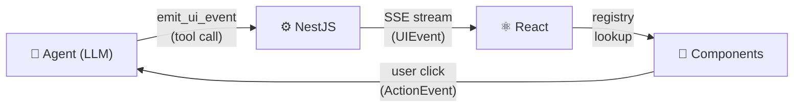

## The Problem

Most AI chat interfaces look the same: a text bubble stream. But real agentic apps need richer output — tables, cards, task boards, status dashboards — rendered safely and consistently.

The naive approach is to have the LLM write JSX or HTML directly. This breaks in practice:

- Output is inconsistent and hard to style
- No validation — the model can emit anything
- No interactivity feedback loop back to the agent
- Impossible to maintain design system coherence

## The Solution

AgentUI introduces a **UI event protocol** between your agent and your frontend:



The agent never touches your DOM. It emits **structured events**. Your frontend renders them through a **whitelisted component registry** you control.

## How It Works

### 1. The agent emits a typed UI event

Instead of writing `<table>...</table>`, the agent calls a tool:

```json
{
  "op": "append",
  "id": "sales-table",
  "component": "data-table",
  "props": {
    "columns": ["Product", "Revenue", "Growth"],
    "rows": [
      ["Pro Plan", "$48,200", "+12%"],
      ["Starter", "$18,700", "+4%"]
    ]
  }
}
```

### 2. AgentUI validates and streams it

The backend validates the event with Zod, then streams it to the client over SSE.

```typescript
// NestJS controller — one line of setup
const controller = createAgentController({ agent, tools });
```

### 3. React renders it through your registry

```typescript
import { createRegistry, AgentUIProvider, AgentRenderer } from '@kibadist/agentui-react';

const registry = createRegistry({
  'data-table': DataTable,
  'info-card':  InfoCard,
  'text-block': TextBlock,
  'task-board': TaskBoard,
  'stat-card':  StatCard,
});

export function App() {
  return (
    <AgentUIProvider registry={registry} sessionId="demo">
      <Chat />
      <AgentRenderer />
    </AgentUIProvider>
  );
}
```

Only components in your registry can be rendered. The model cannot escape the sandbox.

### 4. User actions route back to the agent

```typescript
import { useAgentAction } from '@kibadist/agentui-react';

function TaskCard({ id, title, status }) {
  const dispatch = useAgentAction();

  return (
    <button onClick={() => dispatch({ type: 'task.complete', payload: { id } })}>
      Complete
    </button>
  );
}
```

User interactions are sent back as `ActionEvent`s — the agent can react to them and emit new UI events in response.

## Related

- [Wire Protocol](./wire-protocol.md)
- [Getting Started](./getting-started.md)
