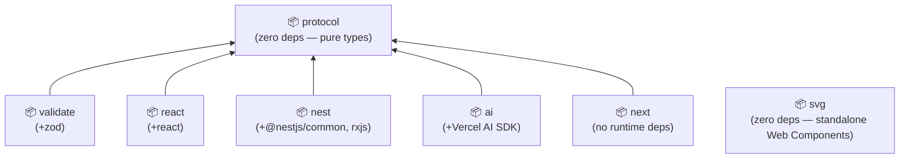

| Package | npm | Purpose |
|---------|-----|---------|
| [`@kibadist/agentui-protocol`](https://www.npmjs.com/package/@kibadist/agentui-protocol) |  | TypeScript types for the wire protocol (`UIEvent`, `ActionEvent`, `UINode`) |
| [`@kibadist/agentui-validate`](https://www.npmjs.com/package/@kibadist/agentui-validate) |  | Zod schemas + parsers (`parseUIEvent`, `safeParseUIEvent`) |
| [`@kibadist/agentui-react`](https://www.npmjs.com/package/@kibadist/agentui-react) |  | Registry, renderer, SSE hook, action context |
| [`@kibadist/agentui-nest`](https://www.npmjs.com/package/@kibadist/agentui-nest) |  | Session event bus + controller factory for NestJS |
| [`@kibadist/agentui-ai`](https://www.npmjs.com/package/@kibadist/agentui-ai) |  | Provider-agnostic adapter via Vercel AI SDK (OpenAI, Anthropic, Google, DeepSeek) |
| [`@kibadist/agentui-llm`](https://www.npmjs.com/package/@kibadist/agentui-llm) |  | Provider-native LLM stream adapters (Anthropic, OpenAI, Gemini) |
| [`@kibadist/agentui-next`](https://www.npmjs.com/package/@kibadist/agentui-next) |  | SSE proxy + action proxy helpers for Next.js App Router |
| [`@kibadist/agentui-svg`](https://www.npmjs.com/package/@kibadist/agentui-svg) |  | SVG-native Web Components for agent workflows, timelines, approvals, memory, and state ([guide](../guides/svg-components/)) |

## Dependency graph

`@kibadist/agentui-svg` is standalone — framework-agnostic SVG Web Components with
no dependency on the protocol or React packages.

## Related

- [Server companion guide](../guides/server-node/)
- [LLM adapters guide](../guides/llm-adapters/)
